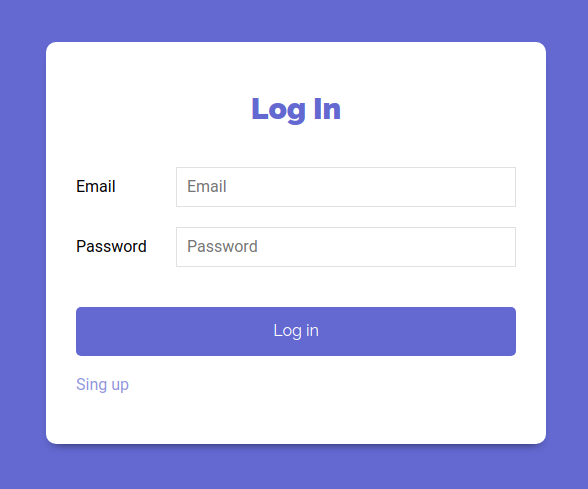
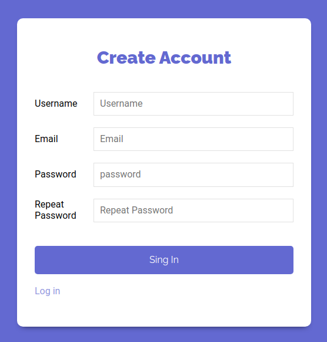
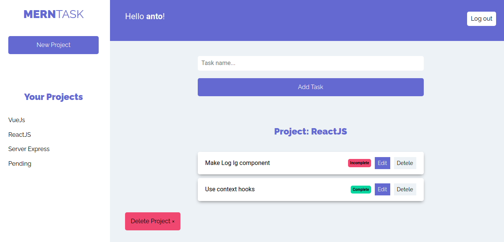

# 😁😁💻 Welcome to my repo, here some information about this project.
<h1>MERN Task Project</h1>

Welcome to my project, please read this .md for understand better this mini project

<ul>
    <h2>Technologies:<h2>
    <li>ReactJS</li>
    <li>JavaScript</li>
    <li>CSS</li>
    <li>MongoDB</li>
    <li>Mongoose</li>
    <li>Express</li>
    <li>NodeJs</li>
    <li>Nodemeiler</li>
</ul>

MERNTask is a project made for users who want to manage different personal projects, is similar to TodoList but better, you can log in and save your information for a long time. The mean target here, was to apply different technologies and implement authentications such as "Json web token", linked a database through a backend, and serve with a client, in summary, make a full-stack app.

<h2>Media</h2>

